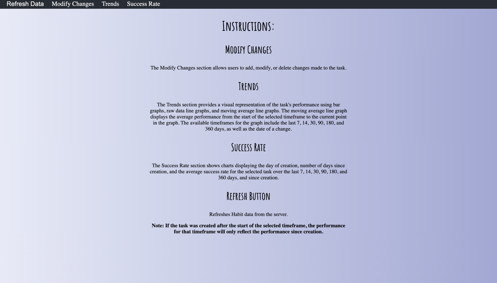
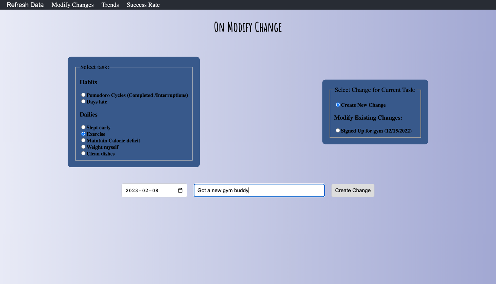
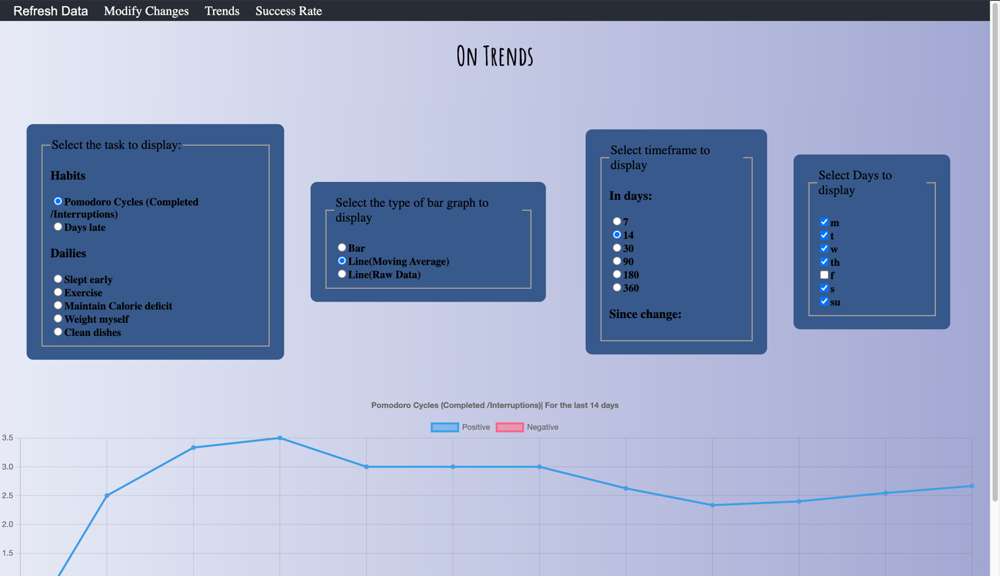
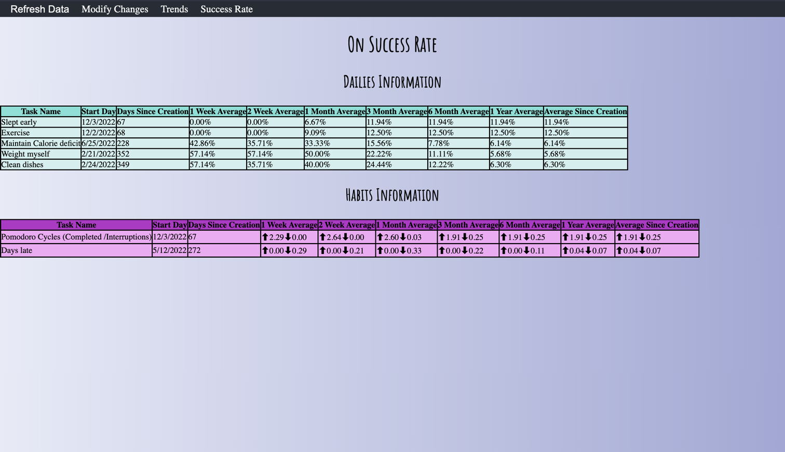

## Introduction 
Welcome to my Habitica Habit Tracking Tool! It's time to turn those resolutions into reality. Our tool is here to help you track changes related to your task and see if they really help you stick to your habits.

Tool link:https://fmolfinoo.github.io/habit-tracking-webapp
## Description of the tool:
My tool is a Habitica third party app that helps you track and evaluate changes related to a habit. A change is defined as an important moment in time when you did something related to the task that can impact your ability to complete it. 

Changes consist of two elements: the title of the change and the date it was made. For example, if your habit is exercise, a change could be getting a gym buddy on February 17th, 2022. The tool allows you to track these changes and see if they were effective in maintaining the habit you can also check your habit history over a certain period of time (the past 7, 14, 30, 90, 180, and 360 days). The purpose of the tool is to help you maintain your habit and evaluate the effectiveness of any changes made.

### Sections:
The page contains three sections:
#### Modify Changes Section:
That let you add, modify (modify the date and name) or delete changes associated with each task.

#### The Trends Section: 
This section let you see how well you performed in the selected task by displaying your performance on a visual way via plots. The plots currently available are graphs bar, line with raw data and line moving average. The timeframes that we can use for the graph go since the date we make a change or some common timeframes the last 7,14,30,90, 180 and 360 days.

#### The Success Rate Section: 
Show you charts with the following information for each task: the day of creation and the number of days since that day, the average success rate for the last 7,14,30,90, 180 and 360 days and since creation.

#### The Refresh Data Button
It refreshes Habit data from Habitica server.
#### Note:
1) **You need a [Habitica](https://habitica.com/) Account to use it.**
2) **The tool does not contact any other server other than the Habitica one and process all the information locally.**
3) To logout simply close all opened windows of the tool. 4
4) If a task was created after the start of a timeframe of a graph. For example, we created the task this week, and you check the last 30 days of performance you will only get the result of this week or the performance since creation on both the plots and graphs in this application. 
5) The moving average shows the average performance from the start of the timeframe until each point on the graph. For example, in point 5 we have the average of the first 5 points and on 6 of the first six and so on. This is useful be able to more easily visualise changes in the trend of your performance.